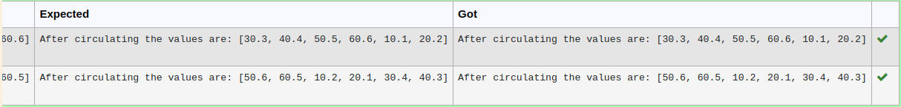

# Circulate-the-values-of-N-variables
## Aim:
To write a python program to circulate the n variables using function concept
## Equipment’s required:
PC
Anaconda - Python 3.7
## Algorithm: 
### Step 1: 
Create a function 
### Step 2: 
Get the input of the numbers from the user
### Step 3: 
Get the value from the user for the number of rotation
### Step 4: 
Using the slicing concept rotate the list
### Step 5: 
Call the function
## Program:
```#Program to circulate N values.
#Developed by: sam
#RegisterNumber: 22008392
def circulate():
    a= eval(input())
    n = int(input())
    print("After circulating the values are:",a[n:]+a[:n])
```

## Output:


## Result:
Thus, the circulation of n variables using function concept is successfully done
